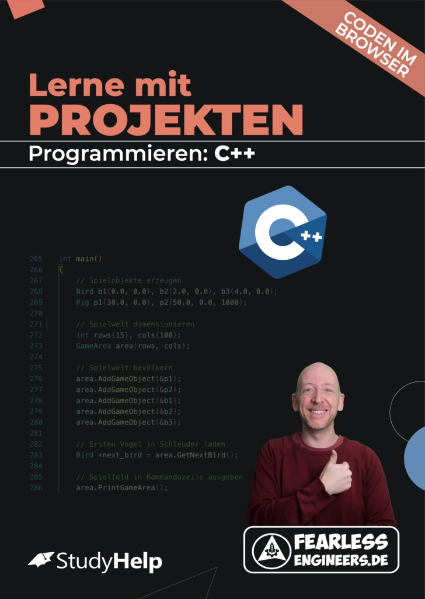
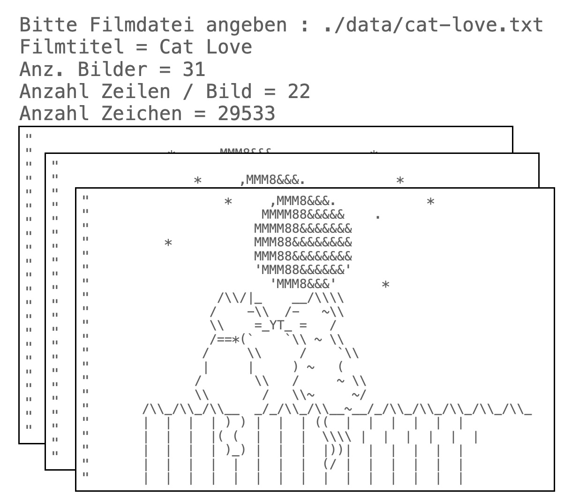

# Movie-Player für ASCII-Filme - Ein Projekt für Anfänger in C++

Du kannst alle Code-Listings direkt in deinem Browser ausführen unter [FearlessEngineers.de](https://www.fearlessengineers.de).

Eine ausführliche Beschreibung aller Code-Listings inkl. der nötigen Programmier-Basics findest du im folgenden Lernheft: 

**Worum geht es?**

In vielen Kursen zum Einstieg in die Programmierung werden die einzelnen Konzepte in einer festen Reihenfolge eingeführt: Meistens geht es los mit einer ausführlichen Einführung in Datentypen und Operatoren sowie Dinge wie Konstanten, Typumwandlungen oder Speicherbedarf.

Das Problem mit dieser Art von Einstieg ist, dass es eine ganze Weile dauert, bis du zu spannenden Themen kommst und etwas greifbares mit deinen neuen Fähigkeiten entwickeln kannst.

Das Lernheft "Lerne Programmieren mit Projekten: C++" geht einen anderen Weg: Du lernst Programmieren an echten Projekten und wirst dir nur diejenigen Grundlagen anschauen, die für die Umsetzung des Projekts unbedingt nötig sind.

Wenn du dich schon mit dem ersten Projekt "Geheime Nachrichten" beschäftigt hast, dann beherrschst du bereits einige wichtige Grundlagen: Du weißt, wie Programme aufgebaut sind, du kennst eine erste Schleifenart und du kannst den Programmfluss verzweigen.

Jetzt wollen wir auf diesem Wissen aufbauen und dir neue Fähigkeiten mitgeben. Das Projekt in diesem Repository ist ein Movie-Player für Filme, die auf Textzeichen (d.h. ASCII-Codes) bestehen.

Um das Programm zu verstehen, musst du dir einige neue Werkzeuge aneignen: Du wirst daher eine neue Schleifenart kennenlernen, du lernst, wie man auf Dateien zugreifen kann und du erfährst, wie umfangreiche Datenmengen (z.B. Filmbilder) im Speicher verwaltet werden.

**Das kannst du nach diesem Projekt:**

- Anweisungen mit Schleifen wiederholen.
- Dateien lesen und schreiben.
- Gleichartige Daten zusammenfassen.
- Mit mehrdimensionalem Daten umgehen.

---

Die Umsetzung des Projekts besteht aus 4 Teilen, die im Lernheft ab Seite 69 detailliert beschrieben sind.

Fragen und Anregungen gerne an kontakt@andreashaja.com.
